# 安装 Vortex

## 概述

- Nexus 是世界上最大的 MOD 网站
- Vortex 是 Nexus 开源的 MOD 管理器

## 步骤

1. 注册 Nexus 账户 [https://www.nexusmods.com/](https://www.nexusmods.com/)
2. 下载安装 Vortex，若无法成功登录 Vortex 则考虑关闭加速器、修改 hosts 文件

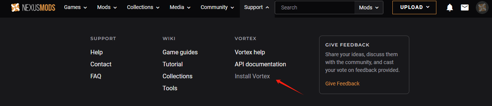

3. Vortex 需要 .NET 6，在 Win+r 打开运行输入 `powershell` ，在弹出的终端输入 `dotnet --list-runtimes` 查看是否存在，不满足则点击下载

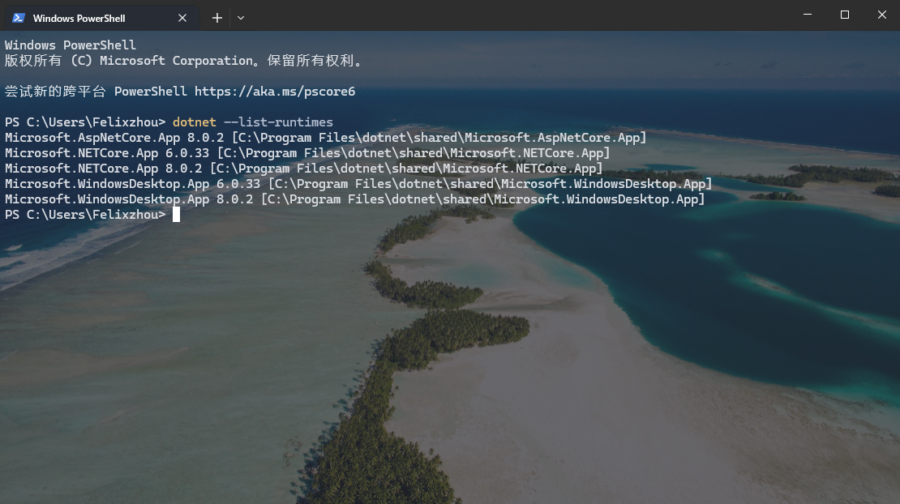

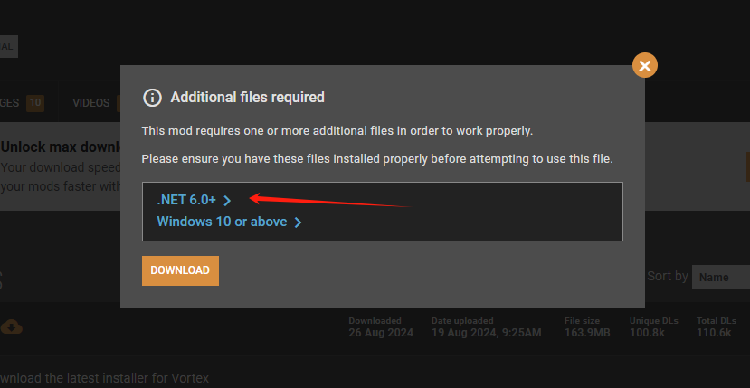

4. 安装中文扩展，黑猴扩展可以在添加游戏的时候自动安装，搜索不到尝试使用魔法再重启

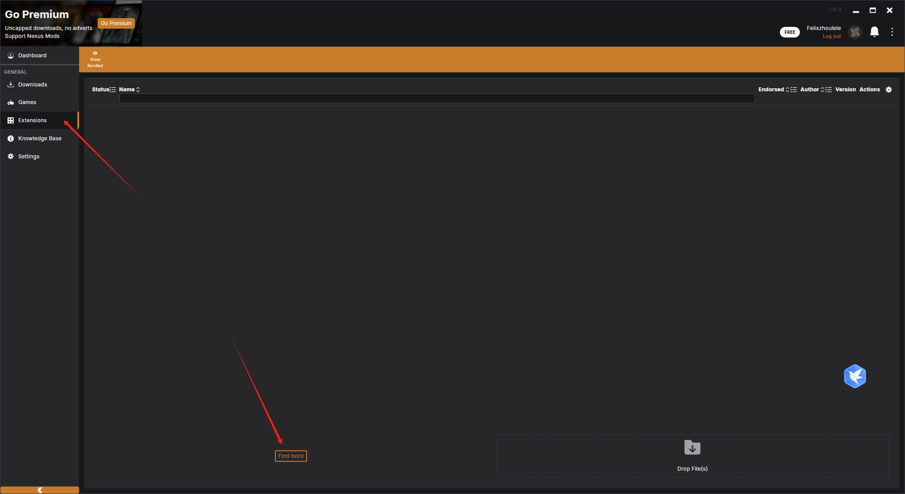

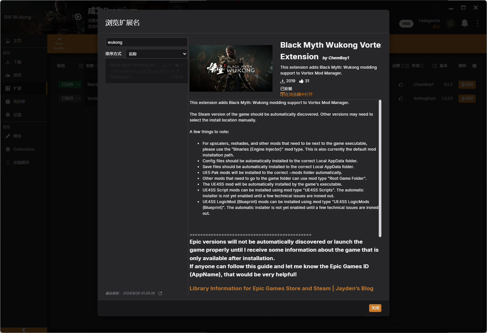

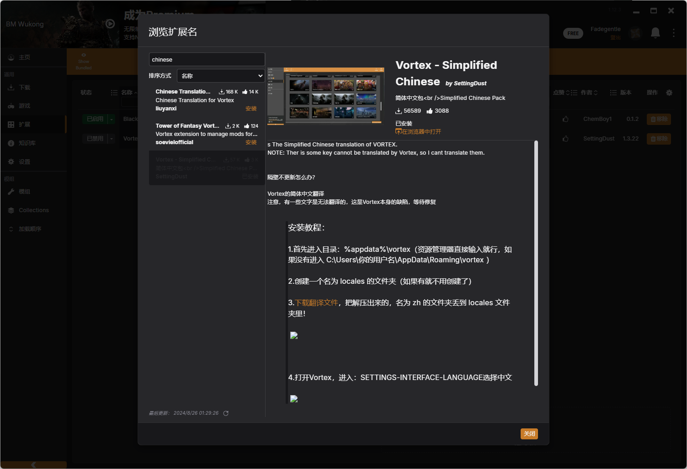

5. 将游戏加入管理

如果扫描不到，尝试使用魔法重启 Steam 和 Vortex

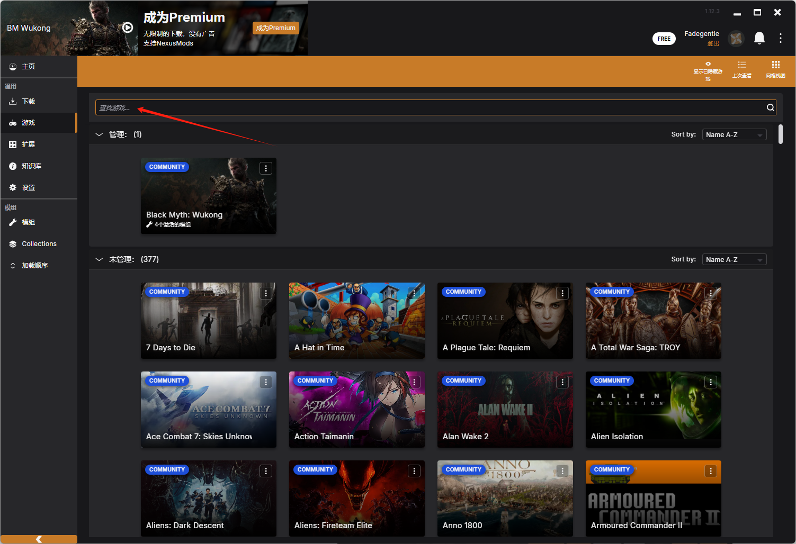

6. 搜索想要的游戏

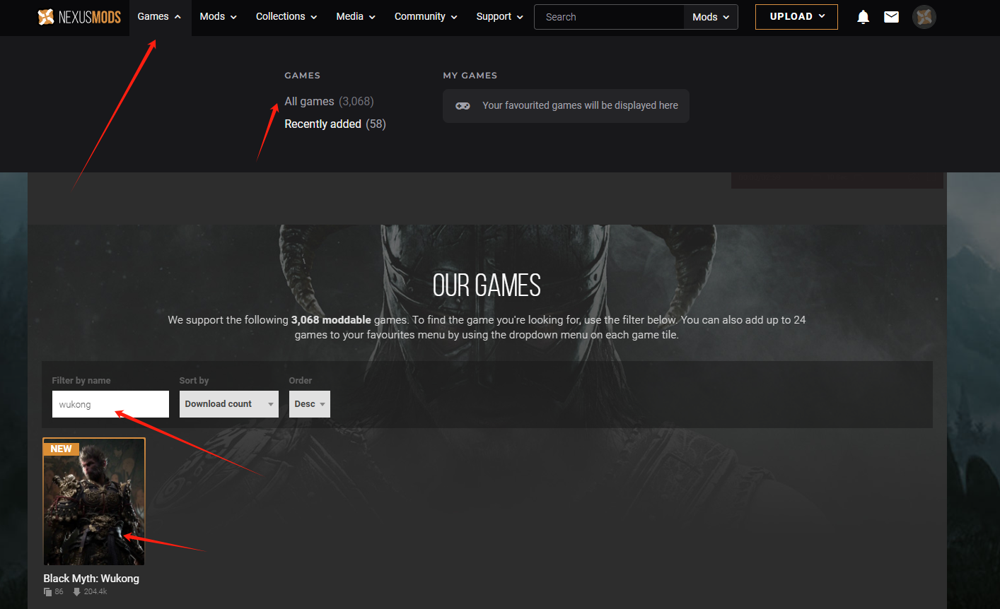

7. 下载安装（部署）MOD [Black Myth: Wukong Nexus - Mods and community (nexusmods.com)](https://www.nexusmods.com/blackmythwukong)

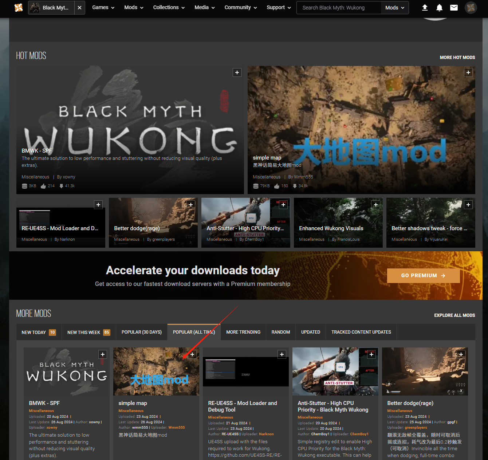

- 使用 Vortex 下载安装

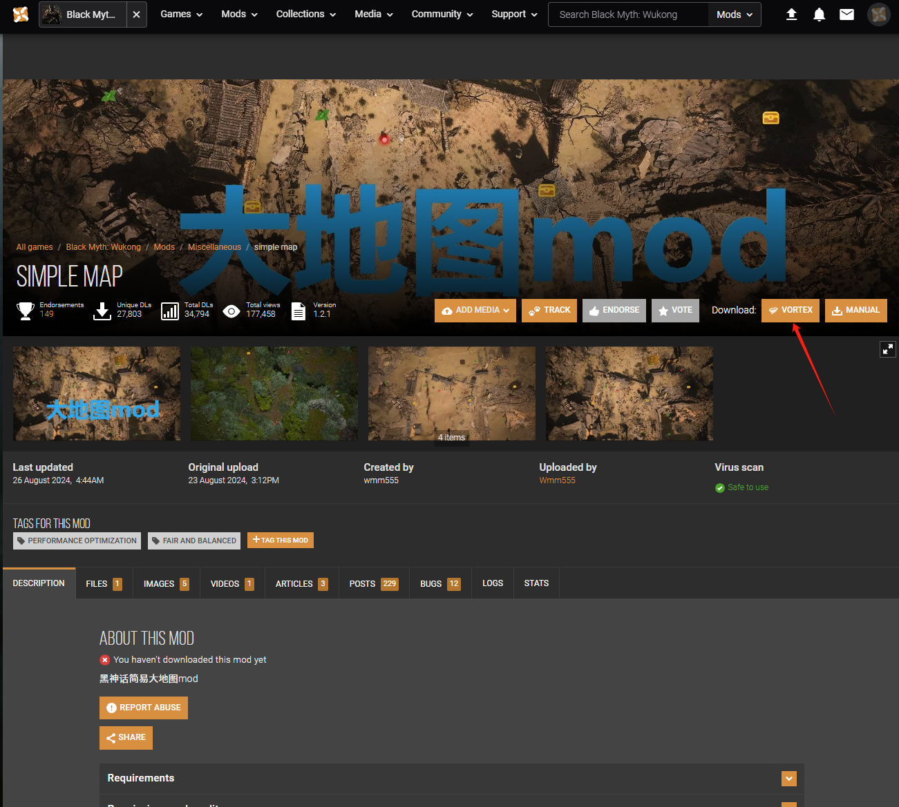

- 有依赖的前置 MOD 包则需要先下载

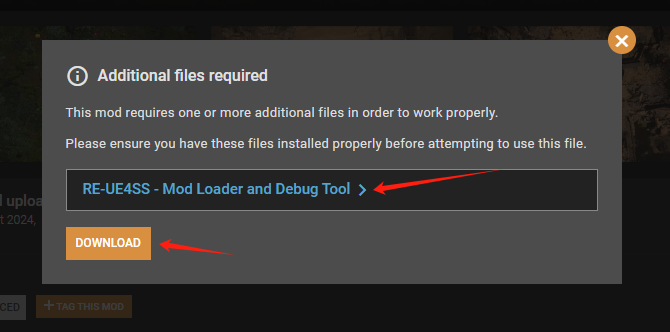

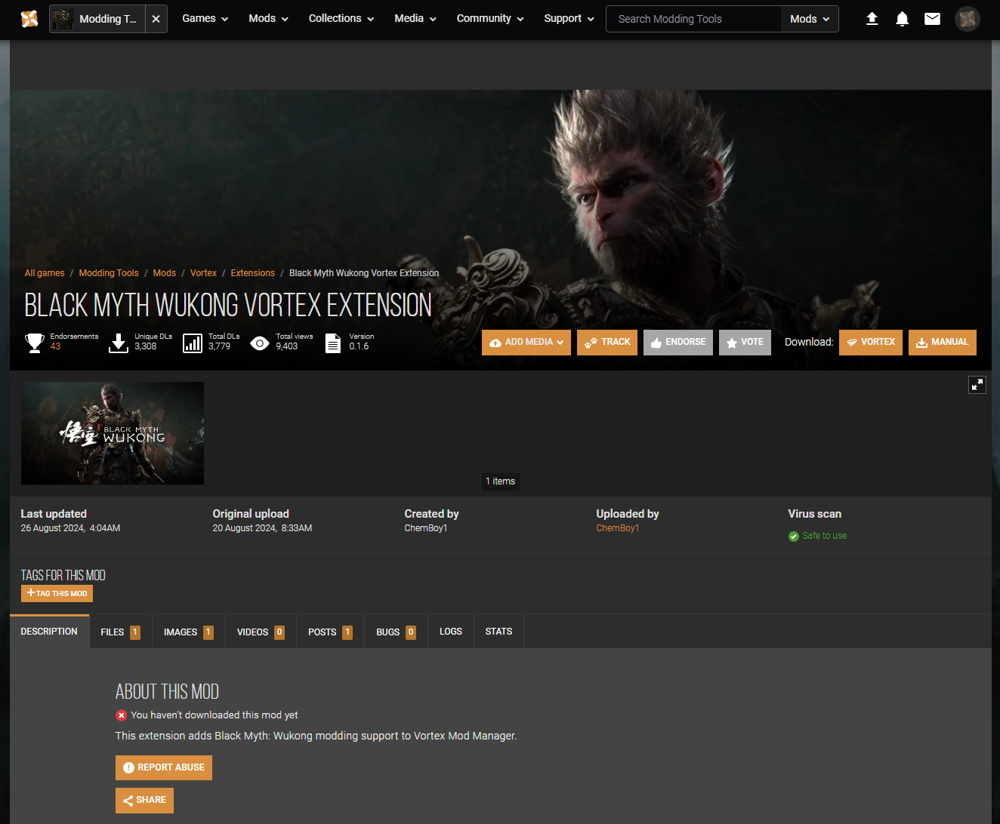

# 推荐 MOD

## 黑神话：悟空（Black Myth: Wukong）

- SimpleMap（俯视大地图，带标记，UE4SS MOD）
- Tag-Teleport（瞬间移动，k 标记，l 瞬移）
- GetAllRebirthPoint（F1 获取所有土地庙，F2 宝箱）
- MicroBlock（任意调节xyz轴坐标，无视空气墙）

# 关于 UE4SS 类的 MOD 注意事项

1. 需要先安装 RE-UE4SS

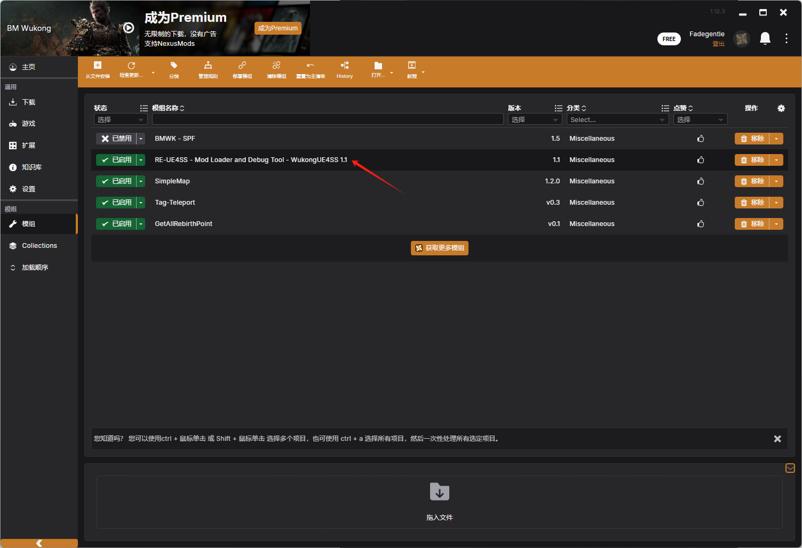

2. 同时在 steam 启动属性添加 `-fileopenlog`

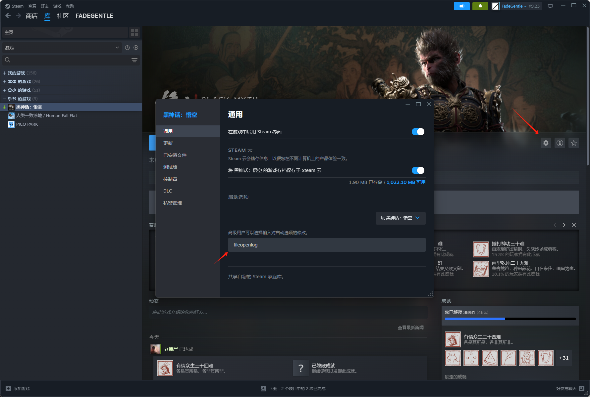

3. 安装 MOD（如：SimpleMap）后，再双击 MOD 选择 模组类型(mod type) `UE4SS LogicMods (Blueprint)`

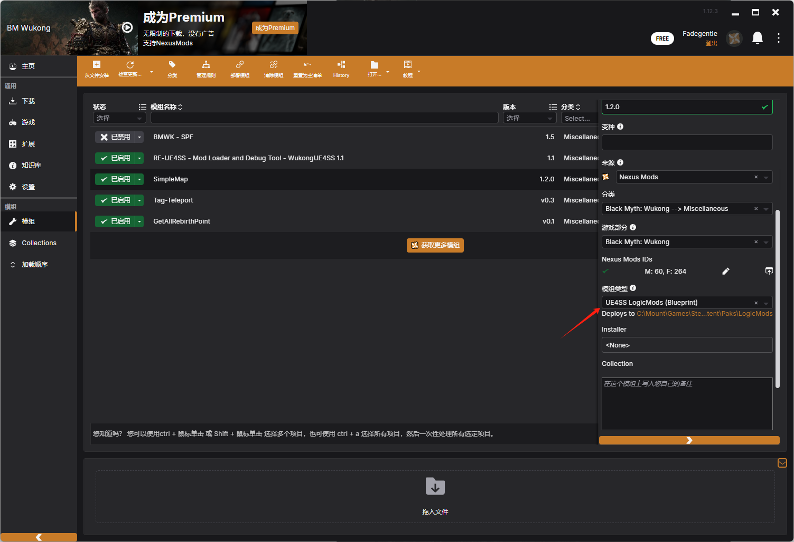

4. 未成功则先启动一次游戏，会自动生成文件夹 `C:\Mount\Games\Steam\steamapps\common\BlackMythWukong\b1\Content\Paks\LogicMods`

# 无法使用的情况下，观察 MOD 结构

1. 打开下载的 MOD 文件夹

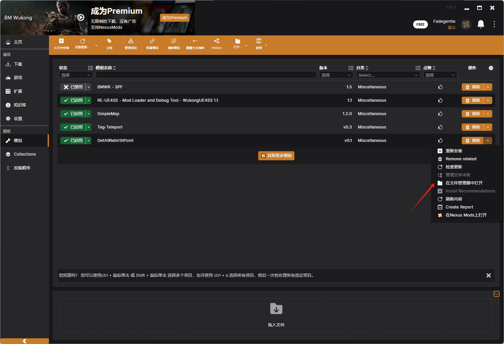

2. 观察比较 MOD 和 游戏 的文件夹，下两图说明该 MOD 是放游戏的 b1 文件夹，在 Vortex 中的模型类型即为 `Root Game Folder`，手动则直接挪到游戏根目录

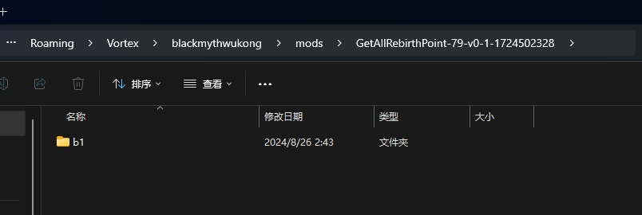

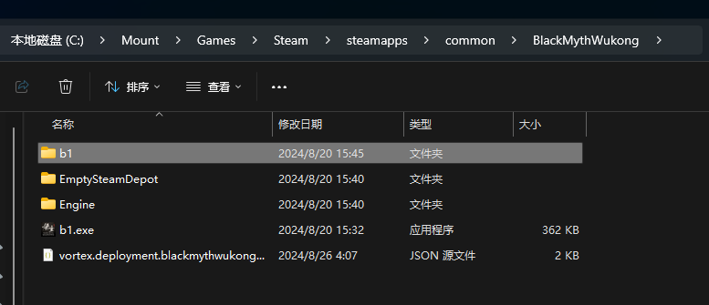