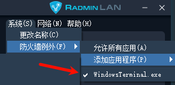
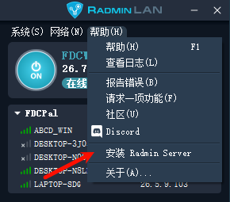

- [服务器](#服务器)
- [玩家](#玩家)
- [常见问题](#常见问题)
  - [1） Microsoft Visual C++ Runtime](#1-microsoft-visual-c-runtime)
  - [2）Radmin 一直处于 `适配` 状态](#2radmin-一直处于-适配-状态)
  - [3）版本不匹配](#3版本不匹配)
  - [4）延迟过高](#4延迟过高)
  - [5）存档迁移](#5存档迁移)

# 服务器
1. 下载安装游戏服务端 `PalServer`，详细设置可以参考 [幻兽帕鲁攻略心得](https://nga.178.com/read.php?tid=39064759&rand=936)，启动 `PalServer.exe`，如下图即成功

    

2. 下载安装组网工具 [`RadminLAN`](https://dl.radminchina.com/Radmin_LAN.exe)，得到 `ON/OFF 按钮` 旁边的 `服务器 ip`

    

3. 随后 `创建网络` 输入网络名字和密码，`<服务器 ip>:8211` 便作为私服地址

    

4. 将 `PalServer` 添加到 `防火墙例外`（ `PalServer` 没有运行时找不到，或者将 `Palworld\PalServer\Pal\Binaries\Win64\PalServer-Win64-Test-Cmd.exe` 手动添加防火墙外应该也行），成功后如下图

    

5. 下载安装组网服务端 [`RadminServer`](https://dl.radminchina.com/Radmin_Server_CN.msi) 或者 通过 `RadminLAN` 中的 `帮助-安装 Radmin Server` 下载

    

--- 
# 玩家
1. 下载安装组网工具 `RadminLAN`，然后 `加入网络`，输入主机创建网络的名称和密码

    

1. 下载安装游戏本体 `PalWorld`
2. 若默认 `steamid` 会重复角色，故需修改 `Palworld\Engine\Binaries\ThirdParty\Steamworks\Steamv153\Win64\steam_settings` 中的`force_account_name.txt`（修改成 `steam` 用户名或者昵称） 和 `force_steamid.txt`（修改成 `steamid`或者组网中不重复的数字），建议修改成真实 `Steam` 方便存档迁移，[如何获取 `steamid` 官方教程](https://help.steampowered.com/zh-cn/faqs/view/2816-BE67-5B69-0FEC)

3. 启动 `PalWorld.exe`，选择 `加入多人游戏（专用服务器）`

    

1. 在右下角输入 `<服务器 ip>:8211`，点击 `联系`，即可进入

    

--- 
# 常见问题

## 1） Microsoft Visual C++ Runtime
缺少游戏运行环境，需要下载 [vc_redist.x64](https://aka.ms/vs/17/release/vc_redist.x64.exe)，安装后再试试启动帕鲁，还不行则重启电脑后再启动帕鲁

## 2）Radmin 一直处于 `适配` 状态
可能是因为虚拟机的问题，如果不是虚拟机则卸载重装 `RadminLAN`，若还不行便下载 `CCleaner` 彻底清除后再重新安装

## 3）版本不匹配
服务器的版本与玩家的不兼容，需要玩家打补丁跟上服务器的版本，可以参考 [帕鲁更新补丁](https://www.bilibili.com/video/BV1oe411Y7iF)

## 4）延迟过高
如果延迟都很高，多半是服务器开了代理；只是某个很高，基本就是那个玩家开了代理或者防火墙拦截

## 5）存档迁移
参考 [幻兽帕鲁攻略心得](https://nga.178.com/read.php?tid=39064759&rand=936)