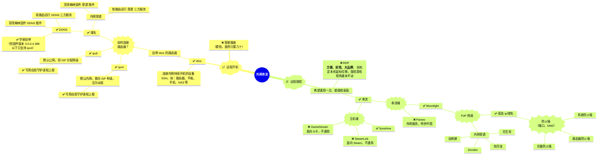

> PS: 
> [Windows&BIOS WoL Setting 网络唤醒系统设置](./小技巧.md#windows) 
> [Sunshine Github Releases 主机端下载](https://github.com/LizardByte/Sunshine/releases) 
> [Moonlight All Platforms 串流端下载](https://github.com/moonlight-stream) 
> [Moonlight Internet Hosting Tool 配置工具下载](https://github.com/moonlight-stream/Internet-Hosting-Tool/releases)