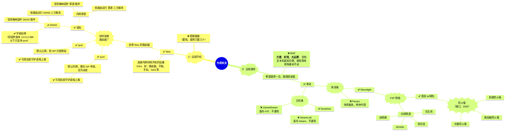

> PS: 
> [Windows&BIOS WoL Setting 网络唤醒系统设置](./小技巧.md#windows) 
> [Sunshine Github Releases 主机端下载](https://github.com/LizardByte/Sunshine/releases) 
> [Moonlight All Platforms 串流端下载](https://github.com/moonlight-stream) 
> [Moonlight Internet Hosting Tool 配置工具下载](https://github.com/moonlight-stream/Internet-Hosting-Tool/releases)

## 内网穿透

> ps：
> 一般建议使用 p2p 穿透，这样三方服务器只用于建立连接，不受限于其的 流量、带宽、网速

内网穿透的核心目标是 **让两个位于 NAT（网络地址转换）后的设备**能够直接通信。在 NAT 环境下，私有网络的设备（如家庭路由器后的设备）通常无法直接与外部互联网通信，因为它们有私有 IP 地址，而外部网络只知道公有 IP 地址。

为了克服这个问题，内网穿透使用了一些技巧来“打破” NAT 限制：

1. **STUN（Session Traversal Utilities for NAT）**：
   - STUN 是一种协议，用于帮助设备发现自己的公有 IP 地址和 NAT 后的端口。通过 STUN，设备能够确定自己在 NAT 设备后面的外部 IP 和端口。
   - 但是，STUN 并不适用于所有类型的 NAT。尤其是 **对称 NAT** 类型，STUN 就无法穿透。

2. **TURN（Traversal Using Relays around NAT）**：
   - 如果 STUN 无法穿透 NAT，使用 TURN 协议的 **中继服务器**就可以帮助设备建立连接。TURN 服务器充当了中转站，所有的通信流量都通过 TURN 服务器进行转发。
   - TURN 是一种端口转发技术，数据通过服务器中转。虽然 TURN 能够确保通信的成功，但它的性能较低，因为所有的流量都要通过第三方服务器中转。

3. **ICE（Interactive Connectivity Establishment）**：
   - ICE 协议是一种更全面的 NAT 穿透机制，它结合了 STUN 和 TURN。在尝试建立 P2P 连接时，ICE 会首先尝试通过 STUN 直接建立连接，如果不行，再使用 TURN 服务器进行中继。
   - ICE 采用了 **候选地址** 的方式，首先尝试 STUN 连接，若失败则回退到 TURN。

### P2P 内网穿透过程
1. **客户端通过 STUN 服务器** 获取自己的公网地址，尝试建立直连。
2. **如果直连失败，使用 TURN 服务器** 中转数据（即通过端口转发）。
3. **如果连接成功**，通信就通过 P2P 直接进行，之后的流量不会再经过 TURN 服务器。
4. **如果连接仍然失败**（如 NAT 类型不支持任何穿透），可能需要使用更多的中继技术或者人工干预。

### 非 P2P 内网穿透过程
1. **客户端通过端口转发（Port Forwarding）**：设备上的应用程序通过端口转发，将公网 IP 地址与局域网内设备的端口进行映射，从而使外部设备能够通过该映射连接内网设备。
2. **VPN连接**：通过在内网和公网之间建立 VPN 隧道，设备可以在 VPN 内部直接通信。所有流量都通过 VPN 服务器进行转发。
3. **反向代理**：例如，在 Web 服务中，内网设备将流量通过反向代理服务器转发到公网，通过该服务器提供服务。外部客户端只需连接到代理服务器即可。

#### 与P2P的区别：
- **中心化**：非P2P内网穿透通常依赖一个中介服务器来转发数据。所有通信流量都通过该服务器处理，这样确保了通信的可用性，但会增加延迟和流量消耗。
- **无直接连接**：非P2P方式并不会直接在两个设备之间建立连接，而是通过一个服务器或网关转发流量。客户端和服务器之间建立连接，客户端与客户端之间的数据并不直接交换。
- **常见应用**：常用于需要公网访问内网服务的场景，如公司内部服务访问、远程桌面、Web 应用程序的访问等。

### 比较：

| 特性            | P2P内网穿透                              | 非P2P内网穿透                           |
|-----------------|-----------------------------------------|----------------------------------------|
| **数据流动方式**  | 点对点（直接通信）                        | 通过中继服务器或代理转发数据             |
| **依赖的技术**    | STUN、TURN、ICE、NAT穿透                | 端口转发、VPN、反向代理                  |
| **连接方式**      | 客户端与客户端直接连接                   | 客户端与服务器连接，服务器转发数据        |
| **服务器负担**    | 初期连接建立时可能使用 TURN 中继服务器  | 数据全程通过中继服务器，负载较大           |
| **适用场景**      | 音视频聊天、文件共享、游戏等需要低延迟的应用  | 需要稳定访问内网服务的场景，如远程办公、远程管理等 |

### 非P2P内网穿透的具体技术：
1. **VPN（虚拟私人网络）**：
   - VPN 是一种广泛使用的非P2P穿透技术，它通过在设备和公网之间建立一个加密的隧道，来使得内网设备能够安全地与外部网络通信。VPN 允许客户端通过 VPN 服务器连接，并且所有的通信流量都通过 VPN 服务器进行转发。

2. **反向代理**：
   - 在 Web 服务中，反向代理可以用来将外部请求转发到内网的服务。例如，内网的 HTTP 服务器可以通过 Nginx 或 Apache 配置反向代理，将外部请求转发到内部服务器，外部用户无法直接访问内网服务器，只能通过代理进行访问。

3. **端口映射（Port Forwarding）**：
   - 通过配置路由器或防火墙的端口转发规则，外部设备可以访问内网设备。端口转发是一种常见的非P2P内网穿透方式，通常用于游戏主机、Web 服务和其他需要将内网服务暴露给公网的场景。

4. **中继服务器（Relay Server）**：
   - 中继服务器是一种依赖于服务器的内网穿透方法，数据流通过一个公网服务器转发，确保内网设备能够接收到外部设备的数据。与 P2P 的直接连接不同，所有的数据都通过中继服务器进行转发，可能带来较高的延迟和带宽消耗。
