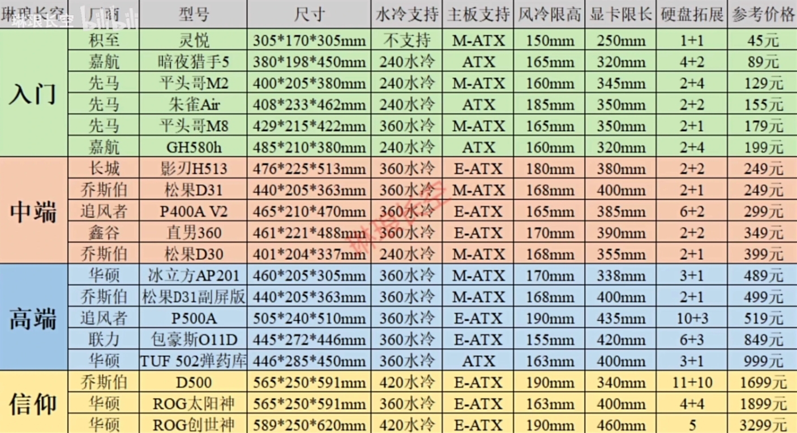

**——*— 按顺序敲定配置 —*——**

- [屏幕](#屏幕)
  - [显卡对应分辨率](#显卡对应分辨率)
  - [HDMI](#hdmi)
- [显卡](#显卡)
- [CPU](#cpu)
- [散热](#散热)
- [风扇](#风扇)
- [硅脂](#硅脂)
- [内存](#内存)
- [硬盘](#硬盘)
- [主板](#主板)
- [电源](#电源)
- [机箱](#机箱)
- [螺丝](#螺丝)
- [音响](#音响)
- [麦克风](#麦克风)
- [键盘](#键盘)
- [鼠标](#鼠标)
- [附录：](#附录)
  - [参考配置](#参考配置)
  - [系统安装](#系统安装)

**——*— 按顺序敲定配置 —*——**

| >>> [装机科普](https://zhuanlan.zhihu.com/p/359667526)

| >>> [装机误区](https://www.zhihu.com/question/587688146)

| >>> [装机错误](https://www.zhihu.com/question/597627441/answer/3003423333)

| >>> [装机教程](https://www.bilibili.com/video/BV1BG4y137mG/?spm_id_from=333.999.0.0&vd_source=1c7cdd62831da9b7b804cd176eb660a0)

---
# 屏幕

- [显示屏系列科普](https://zhuanlan.zhihu.com/p/124995871)
- 屏幕分辨率事关显卡配置
- 27寸比三张 A4 略窄
- 曲屏优缺
    - 沉浸感更强
    - 曲直有误，不能用于设计
    - 长期看，看东西会有凹凸感

---
## 显卡对应分辨率

- 34寸带鱼屏（27寸拓宽为 21:9 两侧多像素点，3440*1440，称：1440P、3K、准4K）

|                     |        **3K（3440*1440）**         |         **4K（3840*2160）**          |
| :------------------ | :--------------------------------: | :----------------------------------: |
| **2K（2560*1440）** | ∆ = 880*1440 880/2560 = 34.375% |  ∆ = 3200*1440 3200/2560 = 125%   |
| **3K（3440*1440）** |                 -                  | ∆ = 2320*1440 2320/2560 = 90.625% |

---
## HDMI

- [HDMI 线材科普](https://www.zhihu.com/tardis/zm/art/425789091?source_id=1005)

---
# 显卡

- [显卡科普](https://www.zhihu.com/question/486324624/answer/2552641162)
- 建议显卡支架，也可用纸筒/泡沫/橡皮/硬币/手办DIY，或者竖装显卡
- [显卡降压超频](https://zhuanlan.zhihu.com/p/621279792)（4080 拉 0.95）

---
# CPU

- [降压超频教程](https://zhuanlan.zhihu.com/p/658558952)
- [降压是否会缩肛（损伤cpu）](https://www.zhihu.com/question/62335676/answer/476833176)
- 14700K参考降压（1.174，VID 1.107）

---
# 散热

- 风冷压长期满载 14700K 需 bios降压不降频，日常使用不需要
- 13700K 以上满载皆需考虑水冷

推荐视频：

- [2023旗舰风冷横评](https://www.bilibili.com/video/BV1tu4y1D7Aq/?share_source=copy_web&vd_source=68752ace7f54d3c36303b5405389878e)
- [2022旗舰360水冷横评(下半场）](https://www.bilibili.com/video/BV1H44y1d7qi/?share_source=copy_web&vd_source=68752ace7f54d3c36303b5405389878e)
- [【速评】穿Fin能做到和回流焊相同性能水平？风冷能压14代处理器吗？酷里奥B60T测试报告](https://www.bilibili.com/video/BV18N411s7Yx/?share_source=copy_web&vd_source=68752ace7f54d3c36303b5405389878e)
- [英特尔酷睿14代处理器14700K首发评测！13700K vs 14700K vs 13900K](https://www.bilibili.com/video/BV15N411t7EL/?share_source=copy_web&vd_source=68752ace7f54d3c36303b5405389878e)

---
# 风扇

- 近乎众生平等

> 据说，构建进风量>出风量的风道，机箱内会形成向外的正压，配合防尘网可以做到机箱内部长期防尘。介意可以用 3&4进1出.
>
> 我无所谓，而且我持怀疑态度。灰尘多半是在关机的时候沉积，运行时存在流体力学中的粘滞力，而且此负压是出风比进风强造成，该动态灰尘会否多留并不好判断。

- [你真的了解机箱散热吗？8款热门散热风扇性能测试](https://www.bilibili.com/video/BV1Va411H7gw/?spm_id_from=333.1007.top_right_bar_window_history.content.click&vd_source=1c7cdd62831da9b7b804cd176eb660a0)
- [一个机箱至少要装几个机箱散热器（风扇）?](https://www.zhihu.com/question/471904850/answer/1994809459)
- [[价廉，但物美吗？] 电脑12厘米风扇横测-超高性价比篇](https://www.bilibili.com/video/BV1j24y1W7zm/?spm_id_from=333.788.top_right_bar_window_history.content.click&vd_source=1c7cdd62831da9b7b804cd176eb660a0)

---
# 硅脂

- 硅脂一般会送，但是想要更好的也可以自己买
- 无脑选 `7950` 或者 `7921`，但保质期一般在半年到一年，需要重涂
- 其余的推荐 `道研` 或者其他散热器厂商的硅脂，不过散热器厂商买硅脂的并不多

---
# 内存

- 注意时序延迟

---
# 硬盘

- 固态很好，机械很吵，但他真的很便宜很耐操，甚至可以掏工业垃圾。

---
# 主板

- [华硕主板后缀含义](https://zhuanlan.zhihu.com/p/481825207)
- [微星主板后缀含义](https://zhuanlan.zhihu.com/p/465262791)
- [非最新主板刷 BIOS](https://www.zhihu.com/question/561302387/answer/2739195792)
- 不超频和不建议料的，确定一下接口版本，可以用 B 板
- [带K的CPU上B760居然会发热爆炸？14代i7K、i9K功率研究及解决B板CEP问题降压降温教程](https://www.bilibili.com/video/BV1bH4y1r7tN/?spm_id_from=333.1007.tianma.1-1-1.click&vd_source=1c7cdd62831da9b7b804cd176eb660a0)
- 安装的时候可以先洗手摸地去除一下静电，以防击穿主板
- [超频和 ERP 设置](https://zhuanlan.zhihu.com/p/33879041)

---
# 电源

- 40系显卡要买 ATX3 电源，其实如果以后会升级，都建议买。

---
# 机箱

---
# 螺丝

- [装机各类螺丝介绍](https://knowledge.ipason.com/ipKnowledge/knowledgedetail.html/1368)

---
# 音响

- 建议学习 HIFI 知识，了解双盲测试，本人只要不辣耳朵，听个响就行。

---
# 麦克风

- 3.5mm接口耳机可能不传输麦克风。

---
# 键盘

- 不要迷信 cherry，国产不赖的
- 客制化可以很贵也可以很便宜
- 个人喜欢矮轴，虽容易进灰，但也容易清灰

---
# 鼠标

- 重点观察模型、侧键、回报率
- 狗屁王很好，但是太贵了。雷蛇、keykron 不输于它。

---

# 附录：

## 参考配置

**——*— 按顺序敲定配置 —*——**

|      | **型号**                                                                                                                                                                                                                                                                                                                                                                                                                                                                                                                                                               | **价格** |      |
| :--- | :--------------------------------------------------------------------------------------------------------------------------------------------------------------------------------------------------------------------------------------------------------------------------------------------------------------------------------------------------------------------------------------------------------------------------------------------------------------------------------------------------------------------------------------------------------------------- | :------- | :--- |
| 屏幕 | [cehua 34' C口 PBP、PIP、KVM 旋转升降 内置音箱](https://detail.tmall.com/item.htm?_u=32p6foe03444&id=725097835227&spm=a1z09.2.0.0.74a22e8dESvI2F&sku_properties=5919063:6536025)[（面板详情）](https://www.panelook.cn/M340ACA-E7B_Innolux_34.0_LCM_overview_cn_59185.html)                                                                                                                                                                                                                                                                                            | 1466.62  | ✅    |
| 显卡 | [索泰 4080 AMP EX AIRO 16G](https://item.taobao.com/item.htm?spm=a1z2k.11010449.931864.4.31e1509dbZFCVb&scm=1007.13982.82927.0&id=707850220292&last_time=1698785941)                                                                                                                                                                                                                                                                                                                                                                                                   | 8799     | ✅    |
| CPU  | [14700K散片+微星 GAMING Z790 WIFI D5板u套（4215）](https://m.tb.cn/h.57ICy23?tk=VorIWXkrFvB)                                                                                                                                                                                                                                                                                                                                                                                                                                                                           | 2894     | ✅    |
| 散热 | [酷里奥 P60T 性能版](https://item.jd.com/10079438350741.html)                                                                                                                                                                                                                                                                                                                                                                                                                                                                                                          | 207.42   | ✅    |
| 内存 | [金百达 银爵 D5 6400/C32 海力士A-die 32G*2](https://item.m.jd.com/product/100046655844.html?utm_user=plusmember&gx=RnAomTM2b2GIypgWrtIiCSemtqi_EG4&gxd=RnAoyzJebGeMnpFGq4Z2X1h-ggky_z0&ad_od=share&utm_source=androidapp&utm_medium=appshare&utm_campaign=t_335139774&utm_term=CopyURL)                                                                                                                                                                                                                                                                                | 1276     | ✅    |
| 硬盘 | [宏碁 GM7000 2T](https://item.m.jd.com/product/100015187245.html?utm_user=plusmember&gx=RnAomTM2b2GIypgWrtIiCSemtqi_EG4&gxd=RnAoyzJebGeMnpFGq4Z2X1h-ggky_z0&ad_od=share&utm_source=androidapp&utm_medium=appshare&utm_campaign=t_335139774&utm_term=CopyURL)                                                                                                                                                                                                                                                                                                           | 678.2    | ✅    |
| 主板 | [14700K散片+微星 GAMING Z790 WIFI D5板u套（4215）](https://m.tb.cn/h.57ICy23?tk=VorIWXkrFvB)                                                                                                                                                                                                                                                                                                                                                                                                                                                                           | 1321     | ✅    |
| 电源 | [振华 LEADEX VII 1000W 金牌全模ATX3.0](https://item.m.jd.com/product/100050222746.html?utm_user=plusmember&gx=RnAomTM2b2GIypgWrtIiCSemtqi_EG4&gxd=RnAoyzJebGeMnpFGq4Z2X1h-ggky_z0&ad_od=share&utm_source=androidapp&utm_medium=appshare&utm_campaign=t_335139774&utm_term=CopyURL)                                                                                                                                                                                                                                                                                     | 894.77   | ✅    |
| 机箱 | [长城阿基米德 KM7B](https://detail.tmall.com/item.htm?ali_trackid=2:mm_133264880_46826420_110969600404:1698765431_015_1127330437&bxsign=tbkgTmoqW3hdk5TY4oeeKgdxTbWBiXJnu9Jr-6qU4mVa1utssI-6snzg-E-JYsdkEUqgOcCG40Am--C6qPyklxp0tvmzhvSWUZSZJqaMB0rx_Bd68yoxKuLnj6APsL5-lZ77Fymg1NMmF9pFjzlVW8uBA&id=646148969671&spm=a2e1u.27655827.d1661933647166.1&union_lens=lensId:OPT@1698765427@2107ad4e_0b99_18b864f5244_8c1d@01@eyJmbG9vcklkIjo2MTc4NH0ie;recoveryid:201_33.80.12.254_613598_1698418033929;prepvid:201_33.8.154.255_530684_1698765426829&skuId=4895668725472) | 235.51   | ✅    |
| 风扇 | [利民 C12C * 3](https://m.tb.cn/h.57GJVRx?tk=2kJ0WXmdMk2)                                                                                                                                                                                                                                                                                                                                                                                                                                                                                                              | 45.72    | ✅    |
| 鼠标 | [Keychron M3-A1](https://item.m.jd.com/product/10080293368305.html?utm_user=plusmember&gx=RnAomTM2b2GIypgWrtIiCSemtqi_EG4&gxd=RnAoyzJebGeMnpFGq4Z2X1h-ggky_z0&ad_od=share&utm_source=androidapp&utm_medium=appshare&utm_campaign=t_335139774&utm_term=CopyURL)                                                                                                                                                                                                                                                                                                         | 227.2    | ✅    |
| 排插 | [德木 外黑孔红 开关触摸计量防雷10A8位1u1c 客制化PDU](https://item.m.jd.com/product/10051519379113.html?utm_user=plusmember&gx=RnAomTM2b2GIypgWrtIiCSemtqi_EG4&gxd=RnAoyzJebGeMnpFGq4Z2X1h-ggky_z0&ad_od=share&utm_source=androidapp&utm_medium=appshare&utm_campaign=t_335139774&utm_term=CopyURL)                                                                                                                                                                                                                                                                     | 299.98   | ✅    |
|      |                                                                                                                                                                                                                                                                                                                                                                                                                                                                                                                                                                        | 18345.42 |      |

>ps：
>原有键盘+屏幕内置音响，刨去显卡价 **9546.42**
>另外该主板阉割输出为 HDMI 1.4 无 DP，故 2k 以上屏幕至少买个亮机卡

---

**——*— 按顺序敲定配置 —*——**

|        | **型号**                                                                                                                                                                                                                                                                                | **价格** |
| :----- | :-------------------------------------------------------------------------------------------------------------------------------------------------------------------------------------------------------------------------------------------------------------------------------------- | :------- |
| 屏幕   | [cehua 34' C口 PBP、PIP、KVM 旋转升降 内置音箱](https://detail.tmall.com/item.htm?_u=32p6foe03444&id=725097835227&spm=a1z09.2.0.0.74a22e8dESvI2F&sku_properties=5919063:6536025)[（面板详情）](https://www.panelook.cn/M340ACA-E7B_Innolux_34.0_LCM_overview_cn_59185.html)             | 1466.62  |
| 显卡   | 4060 8G                                                                                                                                                                                                                                                                                 | 1999     |
| CPU    | [13400散片+微星 B760M BOMBER 爆破弹 WIFI D5（1998）](https://item.taobao.com/item.htm?spm=a1z10.5-c-s.w4002-24551186680.12.68cea5e7n48t7T&id=682062104520)                                                                                                                              | 1998     |
| 散热   | [酷里奥 P60T 性能版](https://item.jd.com/10079438350741.html)                                                                                                                                                                                                                           | 229      |
| 内存   | [金百达 银爵 D5 6400/C32 海力士A-die 16G*2](https://item.m.jd.com/product/100046655844.html?utm_user=plusmember&gx=RnAomTM2b2GIypgWrtIiCSemtqi_EG4&gxd=RnAoyzJebGeMnpFGq4Z2X1h-ggky_z0&ad_od=share&utm_source=androidapp&utm_medium=appshare&utm_campaign=t_335139774&utm_term=CopyURL) | 650      |
| 硬盘   | [宏碁 GM7000 2T](https://item.m.jd.com/product/100015187245.html?utm_user=plusmember&gx=RnAomTM2b2GIypgWrtIiCSemtqi_EG4&gxd=RnAoyzJebGeMnpFGq4Z2X1h-ggky_z0&ad_od=share&utm_source=androidapp&utm_medium=appshare&utm_campaign=t_335139774&utm_term=CopyURL)                            | 678.2    |
| 主板   | [13400散片+微星 B760M BOMBER 爆破弹 WIFI D5（1998）](https://item.taobao.com/item.htm?spm=a1z10.5-c-s.w4002-24551186680.12.68cea5e7n48t7T&id=682062104520)                                                                                                                              | -        |
| 电源   | 振华铜黄450w                                                                                                                                                                                                                                                                            | 239      |
| 机箱   | 长城                                                                                                                                                                                                                                                                                    | 99       |
| 风扇   | [利民 C12C * 1](https://m.tb.cn/h.57GJVRx?tk=2kJ0WXmdMk2)                                                                                                                                                                                                                               | 15       |
| 鼠标   | [Keychron M3-A1](https://item.m.jd.com/product/10080293368305.html?utm_user=plusmember&gx=RnAomTM2b2GIypgWrtIiCSemtqi_EG4&gxd=RnAoyzJebGeMnpFGq4Z2X1h-ggky_z0&ad_od=share&utm_source=androidapp&utm_medium=appshare&utm_campaign=t_335139774&utm_term=CopyURL)                          | 227.2    |
| 键盘   |                                                                                                                                                                                                                                                                                         |          |
| 音响   |                                                                                                                                                                                                                                                                                         |          |
| 耳机   |                                                                                                                                                                                                                                                                                         |          |
| 麦克风 |                                                                                                                                                                                                                                                                                         |          |
|        |                                                                                                                                                                                                                                                                                         | 7601.02  |

---
**——*— 按顺序敲定配置 —*——**

|        | 型号                                                                                         | 价格 |
| ------ | -------------------------------------------------------------------------------------------- | ---- |
| 屏幕   | 考虑显卡配置和帧率推荐1080，但是也能上2K（泰坦军团、华硕小金刚、飞利浦、HKC等）              | 450  |
| 显卡   | A580/二手A750/二手2060（显存剪辑越大越好）（愿意折腾可以6600，甚至6500配1080显示器再战几年） | 799  |
| CPU    | i3400F+B760（主板建议带WiFi）                                                                | 1288 |
| 散热   | 利民AX120SE                                                                                  | 48   |
| 内存   | 16Gx2 金百达 银爵 D5 或者 爱国者 D4 （注意对应主板DDR 版本，不同不兼容）                     | 300  |
| 硬盘   | 凯侠 XG7                                                                                     | 345  |
| 主板   |                                                                                              |      |  |
| 电源   | 振华铜皇 450W                                                                                | 220  |
| 机箱   | 自己看，大不了裸着                                                                           |      |
| 风扇   | 利民 C12C*1（有光更便宜，裸着甚至可以不用买）                                                | 13   |
| 鼠标   |                                                                                              |      |
| 键盘   |                                                                                              |      |
| 音响   | 建议买带音响的显示屏                                                                         |      |
| 耳机   |                                                                                              |      |
| 麦克风 |                                                                                              |      |
|        |                                                                                              | 3463 |

## 系统安装

- 只玩 `Windows` 的推荐使用 `官方 U盘 启动盘制作` 或者 [`微 PE 工具箱`](https://www.wepe.com.cn/download.html)（ 当前最纯净的 `WinPE（ 由官方 PE 加上资源管理器等发展而来 ）` 且附带各种工具 ）
- 需求多种系统的，可以使用 `Ventoy`，但也推荐加个 `WePE` 的镜像，毕竟有一堆好用的工具在里面可以应急
- 启动盘制作的时候有可能会出现两个盘，因为不少启动盘制作工具会同时制作 `GPT (更安全更新更灵活)` 和 `MBR` 两种启动引导，方便兼容以防万一