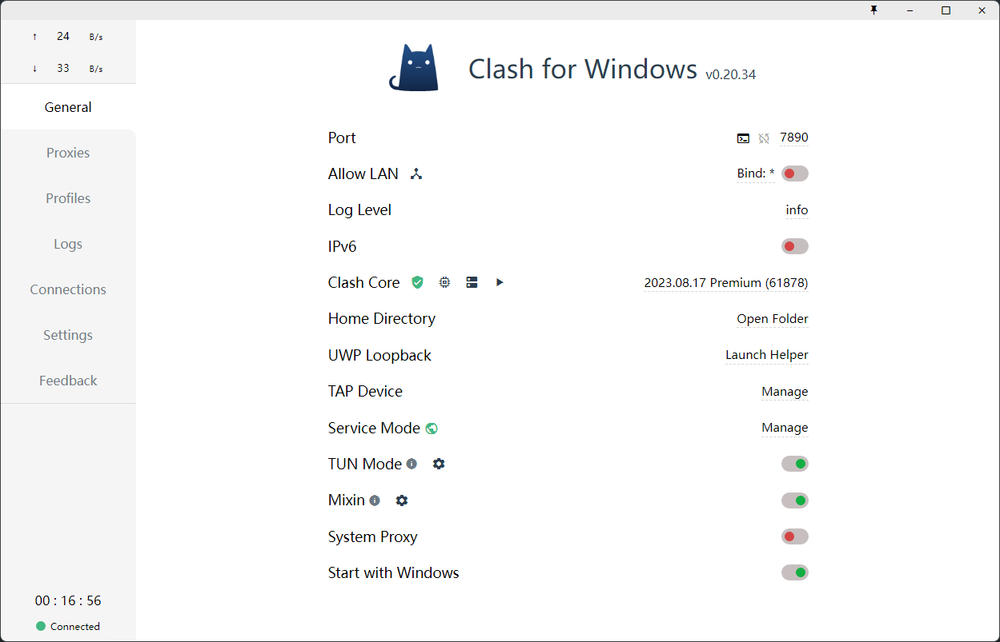
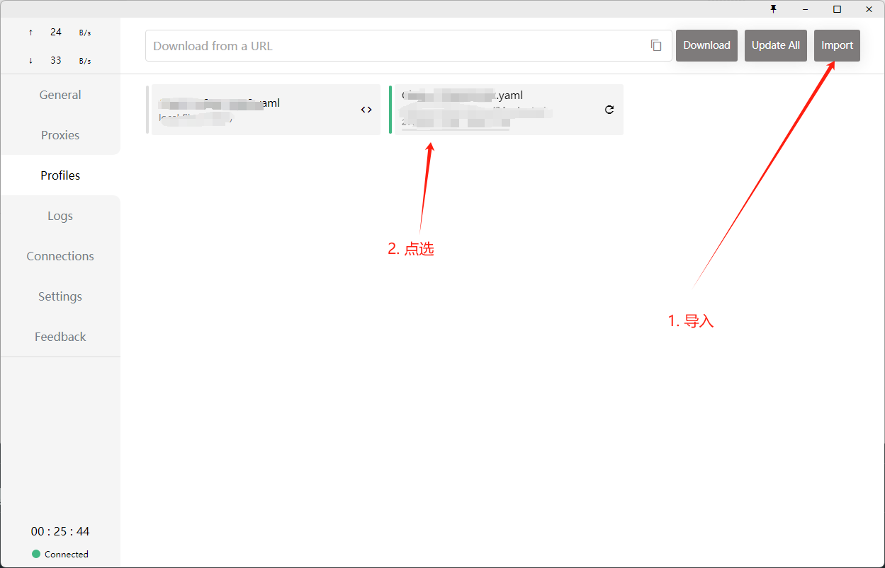
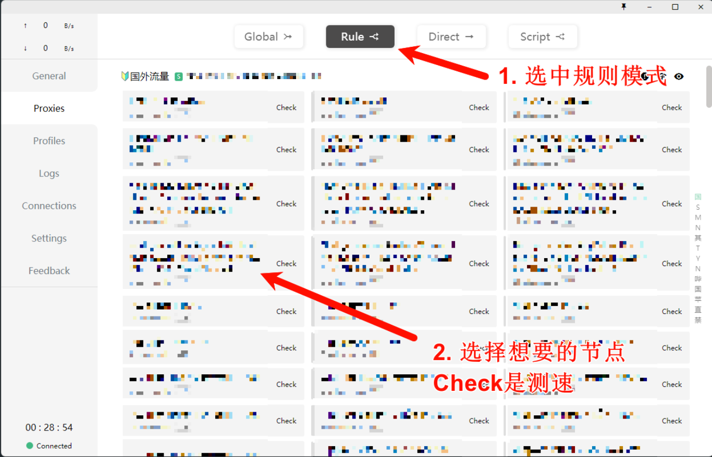
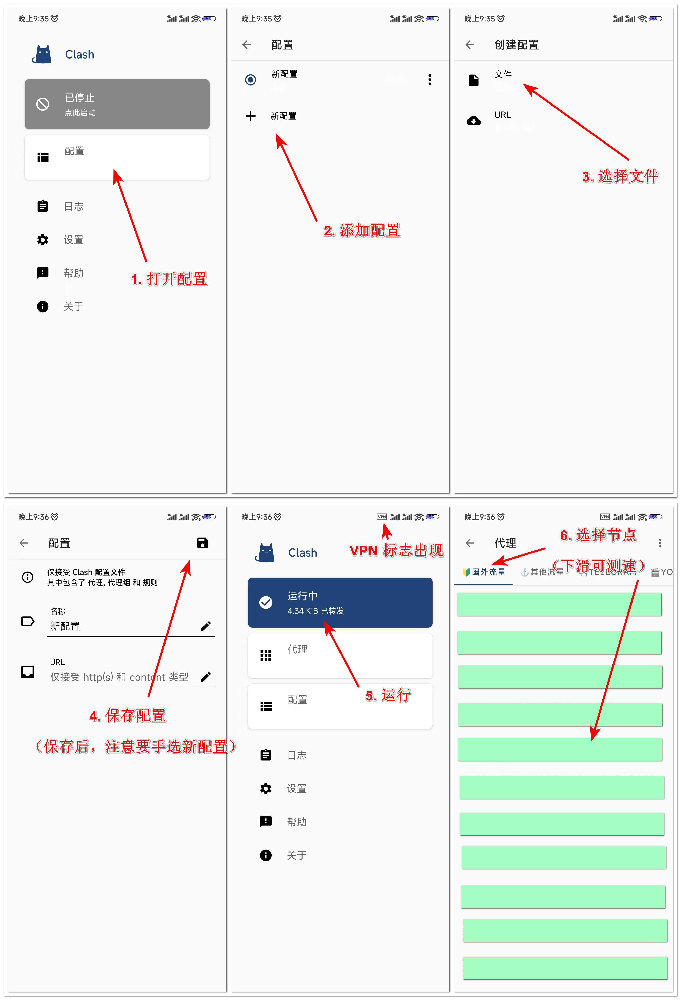

- [Windows: Clash for Windows ( CFW )](#windows-clash-for-windows--cfw-)
  - [基础使用](#基础使用)
- [Android: Clash for Android ( CFA )](#android-clash-for-android--cfa-)
- [MacOS: ClashX Pro](#macos-clashx-pro)
- [iPhone/iPad](#iphoneipad)
- [路由器: Clash Merlin](#路由器-clash-merlin)

# Windows: Clash for Windows ( CFW )

## 基础使用

1. 获得机场节点的 `yaml` 后，点击左侧栏 `Profiles`，选择 `Import` 导入文件

2. 点击左侧栏 `Proxies`，选择 `Rule` 模式，并选择想要的节点

# Android: Clash for Android ( CFA )

# MacOS: ClashX Pro
# iPhone/iPad

1. 使⽤中国⼿机号和美国地址⽣成器注册美区 Apple ID （参考⽂章：
https://zhuanlan.zhihu.com/p/367821925）

   > 美国地址⽣成器建议选以下五个免税州：
   > 
   > 蒙⼤拿州（Montana）
   > 
   > 俄勒冈州（Oregon）
   > 
   > 阿拉斯加州（Alaska）
   > 
   > 特拉华州（Delaware）
   > 
   > 新罕布什尔州（New Hampshire）

2. 登录 `App Store `后下载代理⼯具，推荐 `Potatso` （参考⽂章：
https://itlanyan.com/get-proxy-clients/）

# 路由器: Clash Merlin